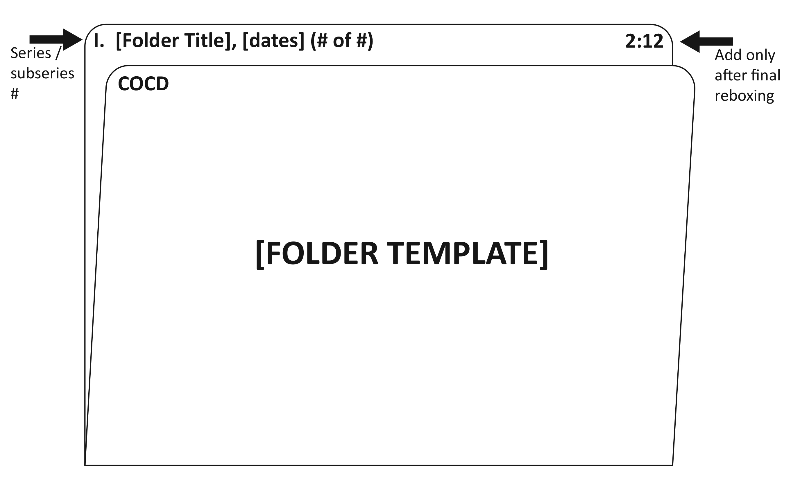
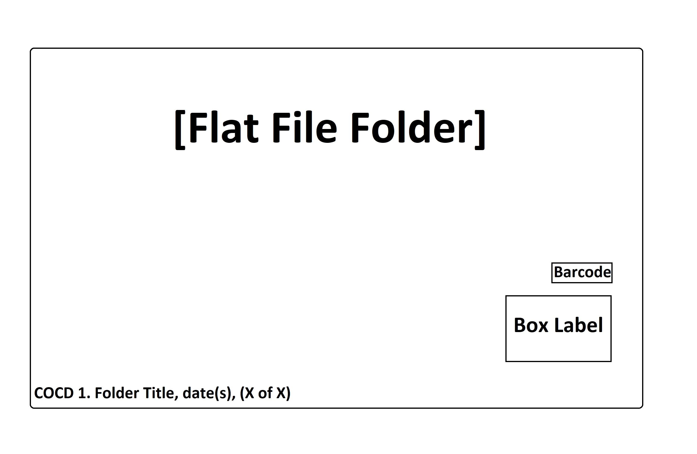

## Physical Processing

### Non-Textual Records in Collections

The processing archivist addresses collections in the aggregate, describing non-textual records with the textual parts of all collections. Descriptions of these materials will be incorporated into the finding aid. Generally group description, similar to a folder or box level description, will be adequate.

It is important to identify the different types of media within a collection since they may have different treatment and storage requirements. (Retain original order when separating formats.)

The following are some examples of formats that may necessitate separate housing:

- Architectural drawings: originals and copies of drawings, plans, elevations, and renderings
- Ephemera
- Graphics, including original artwork and drawings, watercolors, and cartoons
- Photographic media, including albums, cased images, lantern slides, negatives, prints, slides, and stereographs
- Microfilm
- Digital files  

Albums should generally be disassembled during processing, but must be looked at on a case by case basis. The processing archivist should consult with the supervising archivist or librarian and staff as necessary prior to disassembling albums. If appropriate, albums should be paginated and photocopied or digitally copied prior to disassembly.

### Weeding, Discards, and Separations

The term "weeding" encompasses everything from reappraisal of entire series to discarding duplicates. To what level of detail weeding will be done depends on the amount of benefit (in additional clarity, space reduction, and preservation effort) to be gained compared to the amount of time required.

Sometimes it may be more efficient to leave unnecessary materials in the collection than to remove them. Student assistants can perform routine weeding, especially of duplicates, with very clear instructions given concerning the types of materials for discard.

Separations are materials that are peripheral or unimportant to an accession or collection. Separations are sent to other departments in the library, stay in Special Collections and Archives as separate and discrete entities, are returned to donors, or are discarded. It is critical that the details of the gift agreement be followed when arranging for the disposition of separations. The staff member in contact with the donor may be required to return unwanted materials to donors. If unwanted materials do not need to be returned to the donor, discards should be recycled or thrown away, as appropriate.

Publications are normally separated and cataloged for appropriate locations in the library, and are not considered part of the archival or manuscript collection. The catalogers in the library's Collection Access and Management Services Department create catalog records for Special Collections materials. Items are considered for this kind of separation when they have an author, title, publisher, publication date, and do not consist of photocopies. Separated publications are added to the backlog shelves in Stacks along with a flag indicating the accession number and name of the collection from which it originated.

When materials are separated during processing, the "Deaccessions" section in the ArchivesSpace Resource record must be completed. If materials are separated earlier during accessioning, the "Deaccessions" section in the ArchivesSpace Accession record must be completed. Duplicates do not need to be noted, unless there is an extensive number of duplicates. Multiple entries may be made for multiple separation actions as needed. Fill out the information as follows:

| Field    | Instructions |
| -------- | ------- |
| **Portion**    | Part (Whole is only used if you are Deaccessioning the entire collection) |
| **Description**    | A summary of materials and contents as detailed as the materials necessitate. *example: Digital Audio files: undated Monsignor William Barry personal dictations of correspondence.* |
| **Reason**   | Why something was discarded. *examples: publications, crumbling, out of scope* |
| **Disposition**    | Where materials went. *examples: transferred to SC/A book collection, discarded* |
| **Notification Given?**    |Notification is only given when this is requested by the donor as part of the Deed of Gift. |
| **Date Label**    | Deaccession |
| **Date Expression**    |Year Month Day format *example: 2024 June 27* |
| **Date Type**    |Single |
| **Date Begin**    |YYYY-MM-DD format *example: 2024-06-27* |
| **Extent Portion**    |Whole |
| **Extent Number**    |Number representing linear feet or MB/GB/TB. |
| **Extent Type**    |Select linear feet for physical materials or the correct unit type for digital files. |

### Preservation
Special Collections and Archives performs basic preservation techniques in house, such as photocopying acidic originals or removing rusted fasteners. More complicated preservation needs may require vended services. All preservation decisions should be made with an eye to the collection as a whole, and in consultation between the processing archivist, SC/A Librarian, and other staff as necessary. Decisions regarding the migration of audiovisual materials should be made in consultation with Digital Services.

### Storage of Collections
- **Collections in Process**
Unprocessed collections are listed in the ArchivesSpace Accessions module. Generally, collections in process are temporarily stored near the processor's work area or in the designated storage area for collections in process. When collections are permanently removed from the stacks, or are temporarily moved to a different location for more than a week, the location for the container instances attached to the Accession record in ASpace must be updated. 
- **Finished Collections**
When processing is completed collections, [box labels](https://mycsun.box.com/s/s3jjafdk816gb2a22fyga34bnabr1q1a) (internal link) are applied, and collections are shelved in one of the Special Collections and Archives storage areas. Make sure to update the repository area on the box label to reflect the appropriate collecting area. Different parts of a collection can be stored in different locations. Stable 20th and 21st century paper collections are usually stored in AS/RS. Audiovisual materials, fragile paper, photographs, and very small collections may be stored in 4 or Stacks. Consult [digital processing documentation](https://illuminatedpast.github.io/csun-sca-processing/02-processing/02-05-digitalprocessing.html) for up-to-date information on where to store processed digital files.

### Administrative Updates
When processing is completed the processing archivist returns to the ArchivesSpace Accession record(s) and:
- Deletes related accession container instances. If these accession boxes were stored in AS/RS before processing, the Archivists notifies the AS/RS Lead that the AS/RS accession box records can now be deleted.
- Updates the Accession>Collection Management>Processing Status to read “Processed”
- Makes sure that the newly processed collection is listed as a “Related Resource” . This happens automatically if you spawned the resource from that accession, but if not, you must do it manually.

### Physical Processing Guidelines for Student Assistants

The [Physical Processing Guidelines for Student Assistants](https://mycsun.box.com/s/5ka6md1pavzbqxfvohef5qymbprm8920) (internal link) document provides a starting point for Student Assistant processing work, but the guidelines should be adapted as needed for specific collections’ processing needs.

### Folder Template
*Note, at the discretion of the Processing Archivist, a "[graphic materials] note may be added to the folder title. This will not be added to the container list folder title data entered in ASpace, but will alert a researcher in the reading room that they are about to encounter graphic materials.*

### Flat File Folder Template

***

[Back to the CSUN SC/A Processing Guide Start Page](https://illuminatedpast.github.io/csun-sca-processing/)

